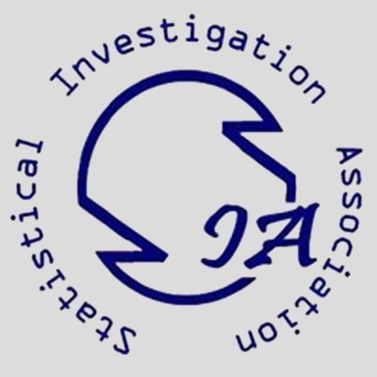

--- 
title: "2022寒假Python训练营"
author: "统计调查协会"
date: "2022-02-08"
site: bookdown::bookdown_site
documentclass: book
description: |
  2022寒假Python训练营
link-citations: yes
github-repo: rstudio/bookdown-demo
---

# Python学习计划{-}

2022年寒假Python训练营 统计调查协会出品

## 学习安排{-}

### 基础入门（2.9-2.12共四天） {-} 

1. 简要介绍学习Python的一些建议，介绍package概念，讲解安装包和配置虚拟环境 &emsp;主讲人：孔令仁
2. Python 语法基础-基本数据类型&输入输出 &emsp;主讲人：曹浩群
3. Python 语法基础-控制结构（条件、循环）&emsp;主讲人：彭显威
4. Python 语法基础-函数和类 &emsp;主讲人：朱璇、王心迪

### 数据科学基本技能（2.13-2.15 共三天）{-}

1. 初识 Numpy &emsp;主讲人：刘冠敬
2. 初识 Pandas，数据清洗实践举例 &emsp;主讲人：刘凯祥
3. 数据可视化-Matplotlib 和 Seaborn &emsp;主讲人：李厚霖

## 参与方式{-}

### 讲座{-}

2.9-2.15日每天上午10:00-11:00，以腾讯会议的形式。每天10点前会在QQ群“2022RUC统计调查协会寒假Python训练营”中发布会议号和链接；

### 课后习题{-}

通过群作业的形式，每天发布在群聊中，请大家提交代码及运行结果截图，根据7天综合打卡情况颁发奖品。

## 推荐自学资源{-}

+ [菜鸟教程](https://www.runoob.com/)：学习Python 和其他语言的一个网站
+ [GitHub](https://github.com/)：上面不光有代码，有项目，也有很奇怪的资源共享。
+ [Stark Overflow](https://stackoverflow.com/)：英文程序社区，如果CSDN 找不到可以在这里搜
+ [pandas 官网](https://pandas.pydata.org/)：Pandas 知识
+ [numpy 官网](https://www.numpy.org.cn/)：numpy 知识
+ [matplotlib 官网](https://matplotlib.org/)：matplotlib 知识
+ [Seaborn 官网](https://seaborn.pydata.org/)：seaborn知识

> 注：非官方运营中文文档的质量不能得到保障，所以文档这种尽量还是看英文原文，或者选取有英文对照/示例的翻译博客。
